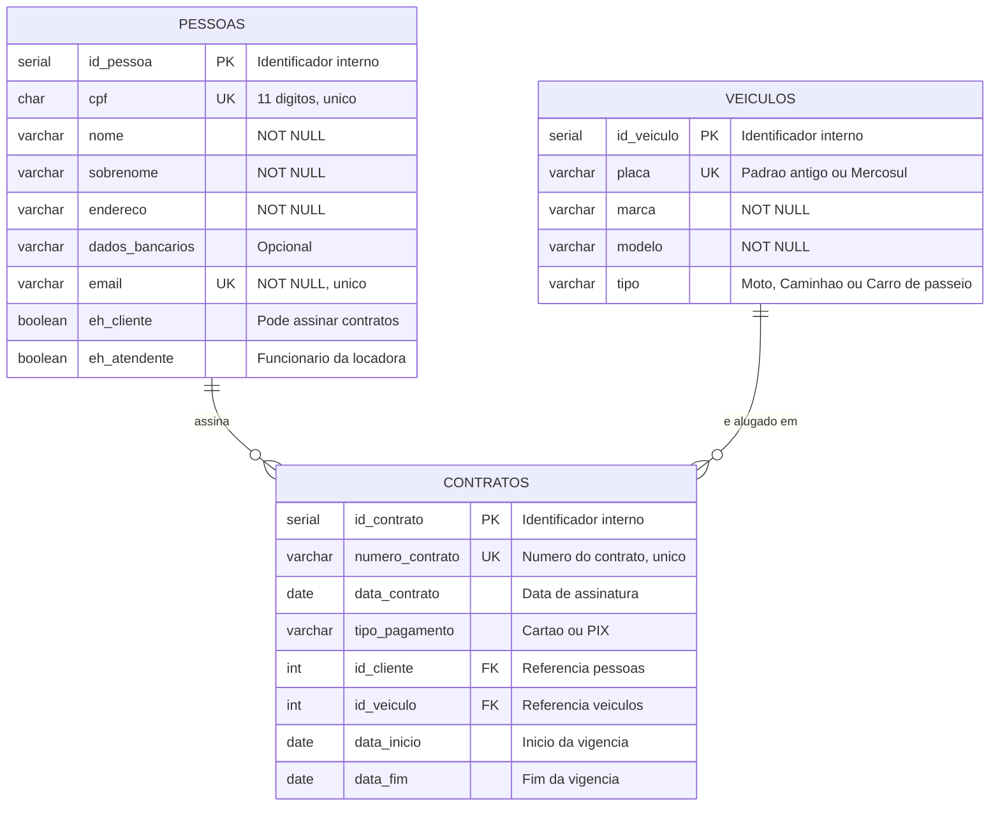

# Sistema de Aluguel de Carros

Projeto da disciplina de Banco de Dados — modelagem e implementação de um
banco de dados relacional em PostgreSQL.

## Tema
Sistema de aluguel de veículos voltado para motoristas de aplicativo.

## Objetivo geral
Modelar e implementar um banco de dados que controle o cadastro de veículos,
clientes e atendentes, além do registro dos contratos de locação, garantindo
a integridade dos dados por meio de chaves primárias, chaves estrangeiras e
demais restrições de integridade.

## Público-alvo
Empresas de aluguel de veículos que atendem motoristas de aplicativo
(Uber, 99, iFood) e os próprios motoristas que precisam de um veículo para
trabalhar sem possuir um carro próprio.

## Escopo
- **Pessoas:** cadastro único que diferencia cliente e atendente, permitindo
  que um mesmo atendente também seja cliente.
- **Veículos:** placa, marca, modelo e tipo (moto, caminhão, carro de passeio).
- **Clientes:** CPF, nome, sobrenome, endereço, dados bancários e e-mail.
- **Contratos:** número, data, tipo de pagamento (cartão, PIX), cliente
  associado, veículo alugado e período de vigência.

## Modelo de dados

O modelo usa uma tabela central `pessoas` com flags de papel (`eh_cliente` e `eh_atendente`)
em vez de duas tabelas separadas. Essa decisão atende ao requisito de que um atendente
também possa ser cliente sem duplicar o CPF em duas tabelas, o que geraria risco de
divergência de endereço, e-mail e dados bancários entre os dois cadastros.

### Regras de integridade aplicadas

| Regra | Onde é garantida |
|---|---|
| CPF único e com 11 dígitos numéricos | `UNIQUE` + `CHECK` em `pessoas.cpf` |
| E-mail único e em formato válido | `UNIQUE` + `CHECK` em `pessoas.email` |
| Toda pessoa tem ao menos um papel | `CHECK (eh_cliente OR eh_atendente)` |
| Tipo de veículo restrito ao domínio previsto | `CHECK` em `veiculos.tipo` |
| Placa no padrão antigo ou Mercosul | `CHECK` em `veiculos.placa` |
| Pagamento apenas em Cartão ou PIX | `CHECK` em `contratos.tipo_pagamento` |
| Fim da vigência não pode anteceder o início | `CHECK (data_fim >= data_inicio)` |
| Contrato não pode iniciar antes da assinatura | `CHECK (data_inicio >= data_contrato)` |
| Contrato sempre aponta para pessoa e veículo existentes | `FOREIGN KEY` com `ON DELETE RESTRICT` |

### Cardinalidades

- Uma pessoa pode assinar zero ou muitos contratos.
- Um veículo pode aparecer em zero ou muitos contratos, em períodos diferentes.
- Cada contrato pertence a exatamente um cliente e a exatamente um veículo.

## Estrutura do repositório

| Pasta | Conteúdo |
|-------|----------|
| `scripts/` | Scripts SQL de DDL e DML |
| `docs/` | Diagrama do modelo de dados |

## Tecnologias
- PostgreSQL