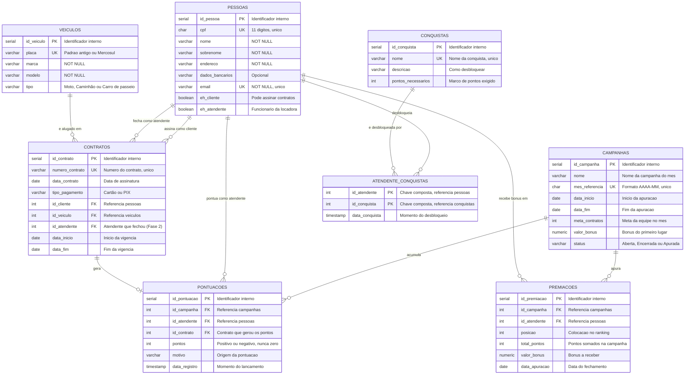

# Atividade Prática: Modelagem e Implementação - Sistema de Aluguel de Carros

**Alunos:** Celso Hector, Daniel Lins, Nicolas Araujo  
**Turma:** Banco de Dados 2026 - G2  
**Data:** 16/09/2026  
**Repositório Git:** https://github.com/hectorex/sistema-aluguel-carros-BD

Projeto da disciplina de Banco de Dados — modelagem e implementação de um
banco de dados relacional em PostgreSQL.

## Tema
Sistema de aluguel de veículos voltado para motoristas de aplicativo.

## Objetivo geral
Modelar e implementar um banco de dados que controle o cadastro de veículos,
clientes e atendentes, além do registro dos contratos de locação, garantindo
a integridade dos dados por meio de chaves primárias, chaves estrangeiras e
demais restrições de integridade.

## Público-alvo
Empresas de aluguel de veículos que atendem motoristas de aplicativo
(Uber, 99, iFood) e os próprios motoristas que precisam de um veículo para
trabalhar sem possuir um carro próprio.

## Escopo
- **Pessoas:** cadastro único onde cliente e atendente são flags (`eh_cliente`,
  `eh_atendente`), o que permite que a mesma pessoa acumule os dois papéis sem
  duplicar CPF.
- **Veículos:** placa, marca, modelo e tipo (moto, caminhão, carro de passeio).
- **Contratos:** número, data, tipo de pagamento (cartão, PIX), cliente
  associado, veículo alugado e período de vigência.
- **Gamificação (Fase 2):** campanhas mensais, pontuação dos atendentes,
  conquistas e premiação por desempenho.

## Fase 2 — Inovação: gamificação da equipe de atendimento

A inovação escolhida foi a **gamificação**, aplicada à equipe de atendimento da
locadora. O objetivo de negócio é aumentar o volume de locações transformando o
trabalho do atendente em uma competição saudável com recompensa financeira.

Como funciona:

1. Todo contrato passa a registrar **qual atendente o fechou** (`contratos.id_atendente`).
2. Cada contrato fechado gera um lançamento de pontos em `pontuacoes`, sempre
   vinculado à **campanha** do mês corrente.
3. Ao longo do mês, marcos de pontuação desbloqueiam **conquistas** para o atendente.
4. No encerramento da campanha, o sistema ordena o ranking e grava o resultado em
   `premiacoes`, com a posição de cada atendente e o valor do bônus a receber.

A coluna `id_atendente` em `contratos` é o ponto de partida da inovação: sem ela
não havia como atribuir uma locação a um atendente, apenas ao cliente.

## Modelo de dados

O modelo usa uma tabela central `pessoas` com flags de papel (`eh_cliente` e `eh_atendente`)
em vez de duas tabelas separadas. Essa decisão atende ao requisito de que um atendente
também possa ser cliente sem duplicar o CPF em duas tabelas, o que geraria risco de
divergência de endereço, e-mail e dados bancários entre os dois cadastros.

Com a gamificação, `pessoas` passa a se relacionar com `contratos` por dois caminhos
distintos — como cliente e como atendente — e ganha três novos vínculos: pontuações,
conquistas e premiações.

### Regras de integridade aplicadas

| Regra | Onde é garantida |
|---|---|
| CPF único e com 11 dígitos numéricos | `UNIQUE` + `CHECK` em `pessoas.cpf` |
| E-mail único e em formato válido | `UNIQUE` + `CHECK` em `pessoas.email` |
| Toda pessoa tem ao menos um papel | `CHECK (eh_cliente OR eh_atendente)` |
| Tipo de veículo restrito ao domínio previsto | `CHECK` em `veiculos.tipo` |
| Placa no padrão antigo ou Mercosul | `CHECK` em `veiculos.placa` |
| Pagamento apenas em Cartão ou PIX | `CHECK` em `contratos.tipo_pagamento` |
| Fim da vigência não pode anteceder o início | `CHECK (data_fim >= data_inicio)` |
| Contrato não pode iniciar antes da assinatura | `CHECK (data_inicio >= data_contrato)` |
| Contrato sempre aponta para pessoa e veículo existentes | `FOREIGN KEY` com `ON DELETE RESTRICT` |
| Mês de referência da campanha único e no formato `AAAA-MM` | `UNIQUE` + `CHECK` em `campanhas.mes_referencia` |
| Status da campanha restrito ao domínio previsto | `CHECK` em `campanhas.status` |
| O mesmo contrato não pontua duas vezes na campanha | `UNIQUE (id_campanha, id_contrato)` em `pontuacoes` |
| Lançamento de pontos nunca é zero | `CHECK (pontos <> 0)` em `pontuacoes` |
| Um atendente aparece uma única vez por campanha premiada | `UNIQUE (id_campanha, id_atendente)` em `premiacoes` |
| Duas pessoas não ocupam a mesma posição no ranking | `UNIQUE (id_campanha, posicao)` em `premiacoes` |
| Conquista não se repete para o mesmo atendente | `PRIMARY KEY (id_atendente, id_conquista)` |

### Cardinalidades

- Uma pessoa pode assinar zero ou muitos contratos como cliente.
- Uma pessoa pode fechar zero ou muitos contratos como atendente.
- Um veículo pode aparecer em zero ou muitos contratos, em períodos diferentes.
- Cada contrato pertence a exatamente um cliente, a exatamente um veículo e a no
  máximo um atendente.
- Uma campanha acumula zero ou muitos lançamentos de pontos.
- Cada contrato gera no máximo um lançamento de pontos por campanha.
- Um atendente pode desbloquear zero ou muitas conquistas, e cada conquista pode
  ser desbloqueada por zero ou muitos atendentes.
- Uma campanha encerrada gera zero ou muitas premiações, uma por atendente.

## Protótipo de interface

Tela de **Ranking dos Atendentes**, onde a gamificação aparece para o usuário:
posição na campanha do mês, pontos acumulados, distância para o primeiro lugar,
bônus previsto, pódio parcial, ranking completo da equipe e conquistas.

O protótipo está em [`ranking_atendentes.html`](ranking_atendentes.html) e usa
dados de exemplo.

## Estrutura do repositório

| Arquivo | Conteúdo |
|---|---|
| `script_completo.sql` | **Script único com todo o projeto** — DDL, DML e a Fase 2 |
| `ranking_atendentes.html` | Protótipo da tela de ranking (Fase 2) |

O `script_completo.sql` reúne, em um único arquivo e na ordem correta de
execução, tudo o que antes estava dividido em scripts separados:

| Parte | Conteúdo |
|---|---|
| Parte 1 | DDL — criação de `pessoas`, `veiculos` e `contratos` |
| Parte 2 | DML — carga de pessoas, veículos e contratos |
| Parte 3 | DML — validação de `UPDATE` e `DELETE` |
| Parte 4 | Fase 2 — DDL da gamificação (`ALTER` em `contratos` e as 5 tabelas novas) |
| Parte 5 | Fase 2 — carga de exemplo das campanhas, pontuações, premiações e conquistas |

O script pode ser executado quantas vezes for necessário sem erro: o DDL usa
`CREATE TABLE IF NOT EXISTS` e `CREATE INDEX IF NOT EXISTS`, as cargas usam
`ON CONFLICT ... DO NOTHING` sobre as chaves únicas, e a chave estrangeira nova
só é criada caso ainda não exista.

## Tecnologias
- PostgreSQL
